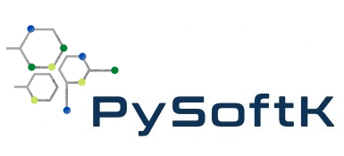

[](https://github.com/alejandrosantanabonilla/pysoftk/actions/workflows/pyci.yml)<!-- Pytest Coverage Comment:Begin -->
<a href="https://github.com/alejandrosantanabonilla/pysoftk/blob/undefined/README.md"></a><details><summary>Coverage Report </summary><table><tr><th>File</th><th>Stmts</th><th>Miss</th><th>Cover</th><th>Missing</th></tr><tbody><tr><td colspan="5"><b>/home/runner/.local/lib/python3.9/site-packages/pysoftk/folder_manager</b></td></tr><tr><td>&nbsp; &nbsp;<a href="https://github.com/alejandrosantanabonilla/pysoftk/blob/undefined//home/runner/.local/lib/python3.9/site-packages/pysoftk/folder_manager/folder_creator.py">folder_creator.py</a></td><td>51</td><td>4</td><td>92%</td><td><a href="https://github.com/alejandrosantanabonilla/pysoftk/blob/undefined//home/runner/.local/lib/python3.9/site-packages/pysoftk/folder_manager/folder_creator.py#L38">38</a>, <a href="https://github.com/alejandrosantanabonilla/pysoftk/blob/undefined//home/runner/.local/lib/python3.9/site-packages/pysoftk/folder_manager/folder_creator.py#L135">135</a>, <a href="https://github.com/alejandrosantanabonilla/pysoftk/blob/undefined//home/runner/.local/lib/python3.9/site-packages/pysoftk/folder_manager/folder_creator.py#L157-L158">157&ndash;158</a></td></tr><tr><td colspan="5"><b>/home/runner/.local/lib/python3.9/site-packages/pysoftk/format_printers</b></td></tr><tr><td>&nbsp; &nbsp;<a href="https://github.com/alejandrosantanabonilla/pysoftk/blob/undefined//home/runner/.local/lib/python3.9/site-packages/pysoftk/format_printers/format_mol.py">format_mol.py</a></td><td>65</td><td>19</td><td>71%</td><td><a href="https://github.com/alejandrosantanabonilla/pysoftk/blob/undefined//home/runner/.local/lib/python3.9/site-packages/pysoftk/format_printers/format_mol.py#L59-L60">59&ndash;60</a>, <a href="https://github.com/alejandrosantanabonilla/pysoftk/blob/undefined//home/runner/.local/lib/python3.9/site-packages/pysoftk/format_printers/format_mol.py#L87-L92">87&ndash;92</a>, <a href="https://github.com/alejandrosantanabonilla/pysoftk/blob/undefined//home/runner/.local/lib/python3.9/site-packages/pysoftk/format_printers/format_mol.py#L116-L121">116&ndash;121</a>, <a href="https://github.com/alejandrosantanabonilla/pysoftk/blob/undefined//home/runner/.local/lib/python3.9/site-packages/pysoftk/format_printers/format_mol.py#L145-L149">145&ndash;149</a>, <a href="https://github.com/alejandrosantanabonilla/pysoftk/blob/undefined//home/runner/.local/lib/python3.9/site-packages/pysoftk/format_printers/format_mol.py#L156-L157">156&ndash;157</a></td></tr><tr><td colspan="5"><b>/home/runner/.local/lib/python3.9/site-packages/pysoftk/htp_tools</b></td></tr><tr><td>&nbsp; &nbsp;<a href="https://github.com/alejandrosantanabonilla/pysoftk/blob/undefined//home/runner/.local/lib/python3.9/site-packages/pysoftk/htp_tools/calculator_htp.py">calculator_htp.py</a></td><td>52</td><td>13</td><td>75%</td><td><a href="https://github.com/alejandrosantanabonilla/pysoftk/blob/undefined//home/runner/.local/lib/python3.9/site-packages/pysoftk/htp_tools/calculator_htp.py#L144-L169">144&ndash;169</a>, <a href="https://github.com/alejandrosantanabonilla/pysoftk/blob/undefined//home/runner/.local/lib/python3.9/site-packages/pysoftk/htp_tools/calculator_htp.py#L244-L250">244&ndash;250</a></td></tr><tr><td colspan="5"><b>/home/runner/.local/lib/python3.9/site-packages/pysoftk/linear_polymer</b></td></tr><tr><td>&nbsp; &nbsp;<a href="https://github.com/alejandrosantanabonilla/pysoftk/blob/undefined//home/runner/.local/lib/python3.9/site-packages/pysoftk/linear_polymer/super_monomer.py">super_monomer.py</a></td><td>51</td><td>7</td><td>86%</td><td><a href="https://github.com/alejandrosantanabonilla/pysoftk/blob/undefined//home/runner/.local/lib/python3.9/site-packages/pysoftk/linear_polymer/super_monomer.py#L148-L156">148&ndash;156</a></td></tr><tr><td colspan="5"><b>/home/runner/.local/lib/python3.9/site-packages/pysoftk/tools</b></td></tr><tr><td>&nbsp; &nbsp;<a href="https://github.com/alejandrosantanabonilla/pysoftk/blob/undefined//home/runner/.local/lib/python3.9/site-packages/pysoftk/tools/utils_rdkit.py">utils_rdkit.py</a></td><td>60</td><td>9</td><td>85%</td><td><a href="https://github.com/alejandrosantanabonilla/pysoftk/blob/undefined//home/runner/.local/lib/python3.9/site-packages/pysoftk/tools/utils_rdkit.py#L44">44</a>, <a href="https://github.com/alejandrosantanabonilla/pysoftk/blob/undefined//home/runner/.local/lib/python3.9/site-packages/pysoftk/tools/utils_rdkit.py#L90">90</a>, <a href="https://github.com/alejandrosantanabonilla/pysoftk/blob/undefined//home/runner/.local/lib/python3.9/site-packages/pysoftk/tools/utils_rdkit.py#L146-L148">146&ndash;148</a>, <a href="https://github.com/alejandrosantanabonilla/pysoftk/blob/undefined//home/runner/.local/lib/python3.9/site-packages/pysoftk/tools/utils_rdkit.py#L172-L180">172&ndash;180</a></td></tr><tr><td colspan="5"><b>/home/runner/.local/lib/python3.9/site-packages/pysoftk/topologies</b></td></tr><tr><td>&nbsp; &nbsp;<a href="https://github.com/alejandrosantanabonilla/pysoftk/blob/undefined//home/runner/.local/lib/python3.9/site-packages/pysoftk/topologies/branched.py">branched.py</a></td><td>40</td><td>1</td><td>98%</td><td><a href="https://github.com/alejandrosantanabonilla/pysoftk/blob/undefined//home/runner/.local/lib/python3.9/site-packages/pysoftk/topologies/branched.py#L120">120</a></td></tr><tr><td>&nbsp; &nbsp;<a href="https://github.com/alejandrosantanabonilla/pysoftk/blob/undefined//home/runner/.local/lib/python3.9/site-packages/pysoftk/topologies/diblock.py">diblock.py</a></td><td>55</td><td>1</td><td>98%</td><td><a href="https://github.com/alejandrosantanabonilla/pysoftk/blob/undefined//home/runner/.local/lib/python3.9/site-packages/pysoftk/topologies/diblock.py#L186">186</a></td></tr><tr><td>&nbsp; &nbsp;<a href="https://github.com/alejandrosantanabonilla/pysoftk/blob/undefined//home/runner/.local/lib/python3.9/site-packages/pysoftk/topologies/ranpol.py">ranpol.py</a></td><td>75</td><td>10</td><td>87%</td><td><a href="https://github.com/alejandrosantanabonilla/pysoftk/blob/undefined//home/runner/.local/lib/python3.9/site-packages/pysoftk/topologies/ranpol.py#L97">97</a>, <a href="https://github.com/alejandrosantanabonilla/pysoftk/blob/undefined//home/runner/.local/lib/python3.9/site-packages/pysoftk/topologies/ranpol.py#L106">106</a>, <a href="https://github.com/alejandrosantanabonilla/pysoftk/blob/undefined//home/runner/.local/lib/python3.9/site-packages/pysoftk/topologies/ranpol.py#L126">126</a>, <a href="https://github.com/alejandrosantanabonilla/pysoftk/blob/undefined//home/runner/.local/lib/python3.9/site-packages/pysoftk/topologies/ranpol.py#L182">182</a>, <a href="https://github.com/alejandrosantanabonilla/pysoftk/blob/undefined//home/runner/.local/lib/python3.9/site-packages/pysoftk/topologies/ranpol.py#L188">188</a>, <a href="https://github.com/alejandrosantanabonilla/pysoftk/blob/undefined//home/runner/.local/lib/python3.9/site-packages/pysoftk/topologies/ranpol.py#L195-L199">195&ndash;199</a>, <a href="https://github.com/alejandrosantanabonilla/pysoftk/blob/undefined//home/runner/.local/lib/python3.9/site-packages/pysoftk/topologies/ranpol.py#L213">213</a>, <a href="https://github.com/alejandrosantanabonilla/pysoftk/blob/undefined//home/runner/.local/lib/python3.9/site-packages/pysoftk/topologies/ranpol.py#L223">223</a></td></tr><tr><td colspan="5"><b>/home/runner/.local/lib/python3.9/site-packages/pysoftk/torsional</b></td></tr><tr><td>&nbsp; &nbsp;<a href="https://github.com/alejandrosantanabonilla/pysoftk/blob/undefined//home/runner/.local/lib/python3.9/site-packages/pysoftk/torsional/torsional.py">torsional.py</a></td><td>88</td><td>10</td><td>89%</td><td><a href="https://github.com/alejandrosantanabonilla/pysoftk/blob/undefined//home/runner/.local/lib/python3.9/site-packages/pysoftk/torsional/torsional.py#L49-L50">49&ndash;50</a>, <a href="https://github.com/alejandrosantanabonilla/pysoftk/blob/undefined//home/runner/.local/lib/python3.9/site-packages/pysoftk/torsional/torsional.py#L226-L237">226&ndash;237</a></td></tr><tr><td><b>TOTAL</b></td><td><b>780</b></td><td><b>74</b></td><td><b>91%</b></td><td>&nbsp;</td></tr></tbody></table></details>

| Tests | Skipped | Failures | Errors | Time |
| ----- | ------- | -------- | -------- | ------------------ |
| 72 | 0 :zzz: | 0 :x: | 0 :fire: | 17m 13s :stopwatch: |

<!-- Pytest Coverage Comment:End -->

<p align="center">
    
</p>


**PySoftK** is a set of Python tools and programs for modelling and simulating polymers with different topologies. The program is still under active 
development and contributions are welcome. A complete introduction into the program can be found in this link [Documentation][1]. 


# Pip installation

To quickly install **PySoftk**, we encourage to do it inside a virtual environment, which can be achieved in the following way:

1. Create a directory named as you want and access it (in this case called work_pol):

```bash 
  [~] mkdir work_pol
  [~] cd work_pol
```

2. Create a virtual environment named pol (this name can be changed, of course) and activate the environment:

```bash 
   [~] python -m venv pol
   [~] source pol/bin/activate
```

3. Get PySoftK from the GitHub repository:

```bash 
  git clone https://github.com/alejandrosantanabonilla/pysoftk.git
```

4. Install PySoftK in this folder using the virtual environment

```bash 
   [~] cd pysoftk
   [~] pip install .
```

**NOTE:** To use the **calculators** option, the code [xtb][2] needs to be installed and linked to the executable using the command:

```bash  
   export PATH="$PATH:$HOME/PATH_TO_FOLDER/xtb-X.X.X/bin"
   export XTBHOME="PATH_TO_XTB_FOLDER/xtb-X.X.X"
   ulimit -s unlimited
```


# Conda installation

These are instructions to 

1. It is recommended to create a new virtual environment in which the [PySoftK][1] dependencies can be installed, for example

```console
   conda create --name pysoftk_env
   conda activate pysoftk_env
```

2. Make a directory to download [PySoftK][1] and change to this directory

```console
   (pysoftk_env) mkdir pysoftk_dir
   (pysoftk_env) cd pysoftk_dir
```

3. Download [PySoftK][1] from Github

```console
   (pysoftk_env) git clone https://github.com/alejandrosantanabonilla/pysoftk.git
```

4. Install [PySoftK][1] and its dependencies as required

```console

   (pysoftk_env) cd pysoftk
   (pysoftk_env) pip install .
```

5. Install [xtb][2] using conda

```console
   conda install -c conda-forge xtb
```

6. You may need to add the [PySoftK][1] installation directory to your .bashrc or .zshrc file

```console 
    PATH=$PATH:/<path to>/pysoftk_dir	
```

That's it, you're ready to use [PySoftK][1] (remember to activate pysoftk_env!)


Replacing **PATH_TO_FOLDER** by the actual path where xtb is stored in your computer.
  
# Testing your installation:
  
5. For testing PySoftK, you need to go to the folder **test** and then type:

```bash 
  pytest
```


[1]: https://alejandrosantanabonilla.github.io/pysoftk/
[2]: https://github.com/grimme-lab/xtb

