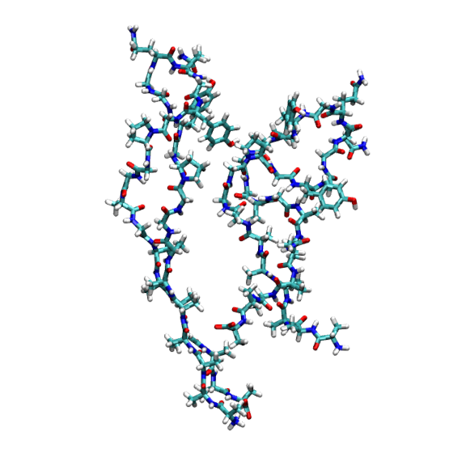
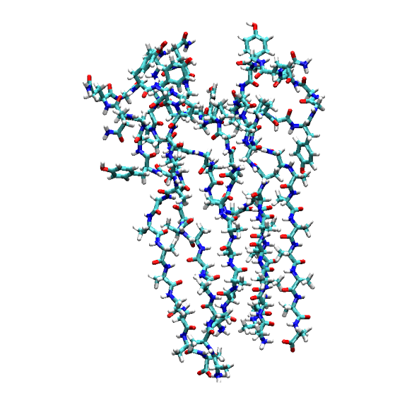

Tutorial: Analyzing $\pi$-$\pi$ Stacking in Proteins with RSA
=============================================================

This tutorial illustrates how to use the Ring Stacking Analysis (RSA) tool within the ``pysoftk`` library to identify and analyze $\pi$-$\pi$ stacking interactions in protein systems. 

Theoretical Background
----------------------

In protein structures, $\pi$-$\pi$ stacking commonly occurs between the aromatic rings of specific amino acid side chains (e.g., Phenylalanine, Tyrosine, and Tryptophan). These non-covalent interactions are critical for protein folding, stability, and protein-protein interactions. The RSA tool identifies these events across periodic boundaries based on two geometric criteria:

1. **Distance Cutoff ($d$):** The minimum distance between the centers of mass of any two aromatic rings.
2. **Angle Cutoff ($\theta$):** The angle between the normal vectors of the two ring planes.

Preparation
-----------

Before starting any analysis, load the necessary modules and define your file paths. 

.. code-block:: python

   import os
   import numpy as np
   import pandas as pd
   import MDAnalysis as mda 
   from pysoftk.pol_analysis.ring_ring import RSA

   # 1. SETUP AND PATHS
   os.makedirs('data', exist_ok=True)
   network_pdb_dir = 'data/network_pdbs'
   os.makedirs(network_pdb_dir, exist_ok=True)

   original_topology = 'data/protein_rsa_noedit.pdb'
   trajectory = 'data/trajectory_rsa_protein.xtc'
   edited_topology = 'data/trajectory_resids.pdb'
   results_file = 'data/rsa_prot_tutorial.parquet'

Step 1: Editing the Protein Structure File
------------------------------------------

.. note::
   **Why is this necessary?** The PySoftK RSA tool identifies distinct macromolecules by their MDAnalysis ``resid``. In a standard protein PDB, the ``resid`` denotes individual amino acids (e.g., Res 1, Res 2) and resets for each chain, leading to overlapping IDs across different proteins. 
   
   To use the RSA tool correctly, **all atoms of the same protein must share a single, unique ``resid``**, and this ID must be different from every other protein in the system.

The following code dynamically iterates through the distinct chains (segments) in your system and assigns a single, unique ``resid`` to each entire protein.

.. code-block:: python

   print(f"--- 1. Processing Initial Topology: {original_topology} ---")
   u = mda.Universe(original_topology, trajectory)

   # Extract all protein atoms and their positions
   proteins = u.select_atoms('protein')
   protein_pos = proteins.positions
   proteins.positions = protein_pos 

   # Assign a unique resid to each protein chain (segid)
   segids = ['A', 'B', 'C', 'D', 'E', 'F', 'G', 'H', 'I', 'J']
   new_resids = []

   for i, seg in enumerate(segids, start=1):
       protein_seg = u.select_atoms(f'segid {seg}')
       seg_len = len(np.unique(protein_seg.resids))
       new_resids.extend([i] * seg_len)

   print(f"Total new resids generated: {len(new_resids)}")
   print(f"Total protein atoms: {len(proteins)}")

   # Overwrite the topology's resids with our new unique identifiers
   proteins.residues.resids = new_resids

   # Save the properly formatted structure for the RSA tool
   with mda.Writer(edited_topology, proteins.n_atoms) as W:
       W.write(proteins)

   print(f"Edited topology saved to: {edited_topology}\n")

.. parsed-literal::

   --- 1. Processing Initial Topology: data/protein_rsa_noedit.pdb ---
   Total new resids generated: 310
   Total protein atoms: 3270
   Edited topology saved to: data/trajectory_resids.pdb

Step 2: Running the Stacking Analysis
-------------------------------------

With the newly formatted structure file, we can run the RSA tool. We will initialize the ``RSA`` calculator using the ``edited_topology``.

.. code-block:: python

   print("--- 2. Running Stacking Analysis ---")

   # Calculation parameters
   ang_c = 30
   dist_c = 5
   start, stop, step = 0, 20, 2

   # Initialize RSA with the NEW edited topology
   rsa_calc = RSA(edited_topology, trajectory)

   # Run the highly optimized calculation
   # write_pdb=False is used because we will generate network PDBs later
   rsa_calc.stacking_analysis(dist_c, ang_c, start, stop, step, results_file, write_pdb=False)
   print("Stacking analysis complete.\n")

.. parsed-literal::

   --- 2. Running Stacking Analysis ---
   Ring Stacking analysis has started...
   Trajectory Progress: 100%|██████████| 10/10 [00:00<00:00, 14.29it/s]
   Function stacking_analysis Took 4.3362 seconds
   Stacking analysis complete.

Step 3: Exploring the Results
-----------------------------

The output is stored in a Pandas DataFrame and saved as a Parquet file. Because we are analyzing entire macromolecules, we can safely drop the redundant ``atom_index`` column to clean up our workspace. The remaining ``pol_resid`` column contains pairs of our newly assigned Protein IDs that are participating in a stacking interaction.

.. code-block:: python

   print("--- 3. Analyzing Output Data ---")

   # Load the DataFrame
   df = pd.read_parquet(results_file)

   # CLEANUP: Drop the 'atom_index' column since the new RSA tool 
   # optimizes by using 'pol_resid' exclusively.
   if 'atom_index' in df.columns:
       df = df.drop(columns=['atom_index'])

   print("Cleaned DataFrame Head:")
   print(df.head())

   print("\nExample of interacting protein pairs in the first recorded stack:")
   print(df['pol_resid'].iloc[0])

.. parsed-literal::

   --- 3. Analyzing Output Data ---
   Cleaned DataFrame Head:
                                              pol_resid
   0                           [[3, 4], [7, 8], [8, 9]]
   1  [[3, 4], [1, 3], [1, 2], [4, 6], [6, 10], [1, ...
   2   [[1, 2], [3, 4], [4, 6], [3, 5], [8, 9], [7, 8]]
   3           [[1, 2], [3, 4], [4, 10], [4, 6], [7, 8]]
   4  [[1, 2], [3, 4], [3, 5], [4, 6], [1, 3], [8, 9...

   Example of interacting protein pairs in the first recorded stack:
   [array([3, 4]) array([7, 8]) array([8, 9])]

Step 4: Network Analysis & PDB Generation
-----------------------------------------

One of the most powerful features of the RSA tool is the ability to extract **Connected Networks**. A graph theory algorithm evaluates the pairs to identify continuous clusters of proteins interconnected through $\pi$-$\pi$ stacking.

The code block below demonstrates how to extract these networks and automatically save each complete, isolated macro-structure as a new ``.pdb`` file for visualization.

.. code-block:: python

   print("\n--- 4. Extracting Connected Protein Networks ---")

   # Extract the network groupings
   sev_ring = rsa_calc.find_several_rings_stacked(results_file)

   # Grab the universe from our RSA calculator and set it to the first frame
   u_rsa = rsa_calc.get_mda_universe()
   u_rsa.trajectory[0] 

   print("Connected Networks (Residue IDs of stacked proteins):")
   if sev_ring and len(sev_ring) > 0:
       for i, network in enumerate(sev_ring[0], start=1):
           print(f"\n  Cluster {i} members: {network}")
           
           # Convert the set of resids into an MDAnalysis selection string
           resid_str = " ".join(map(str, network))
           cluster_selection = u_rsa.select_atoms(f'resid {resid_str}')
           
           # Define the output path and write the PDB
           pdb_filename = os.path.join(network_pdb_dir, f"network_cluster_{i}.pdb")
           with mda.Writer(pdb_filename, cluster_selection.n_atoms) as W:
               W.write(cluster_selection)
               
           print(f"  -> Saved structure to: {pdb_filename}")
   else:
       print("  No networks found.")
       
   print("\nWorkflow complete!")

.. parsed-literal::

   --- 4. Extracting Connected Protein Networks ---
   Connected Networks (Residue IDs of stacked proteins):

     Cluster 1 members: {3, 4}
     -> Saved structure to: data/network_pdbs/network_cluster_1.pdb

     Cluster 2 members: {8, 9, 7}
     -> Saved structure to: data/network_pdbs/network_cluster_2.pdb

   Workflow complete!

Connectivity Visualization
~~~~~~~~~~~~~~~~~~~~~~~~~~

The generated ``.pdb`` files allow you to easily render and study the complete connectivity paths inside your simulation box. You can open these files in PyMOL, VMD, or your preferred visualization software.

   Rendering of the first connected network (Cluster 1, containing Proteins 3 and 4) extracted from the simulation.

   Rendering of the second connected network (Cluster 2, containing Proteins 7, 8, and 9) extracted from the simulation.
