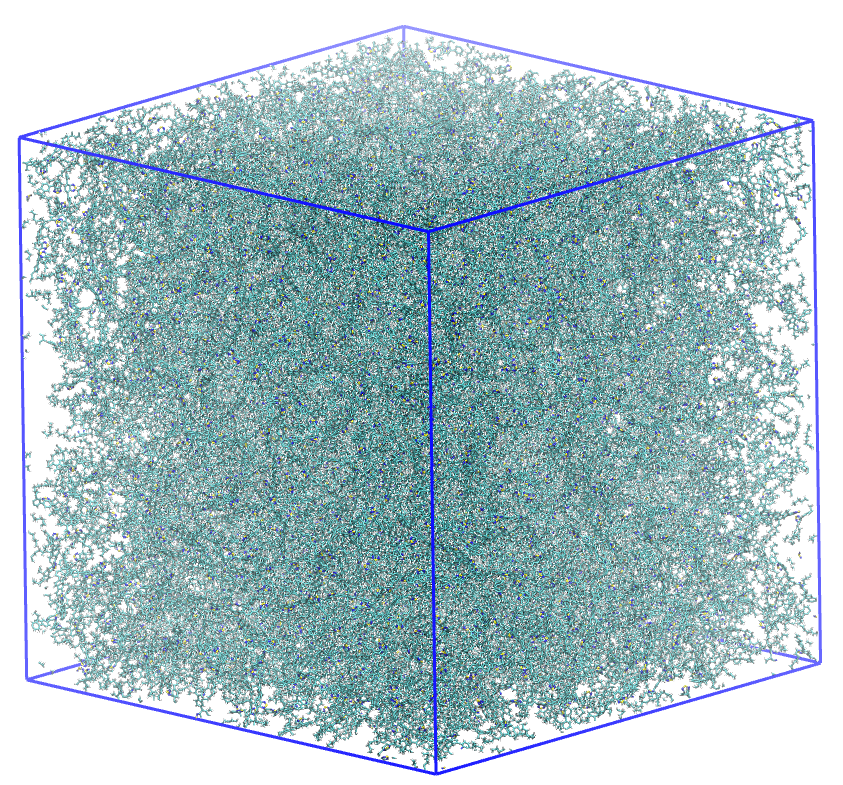
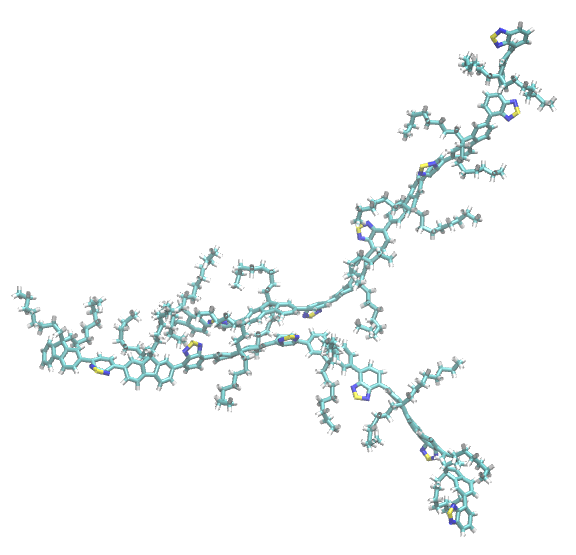
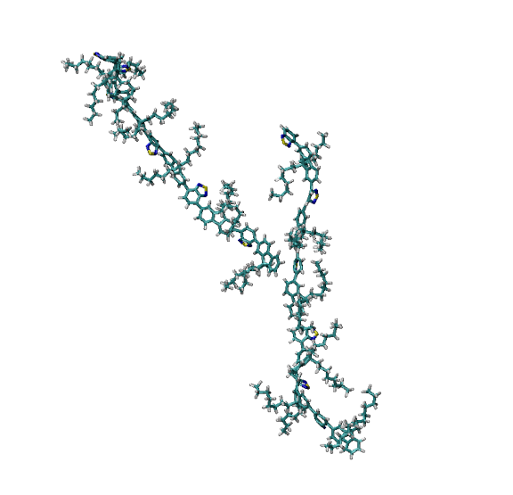
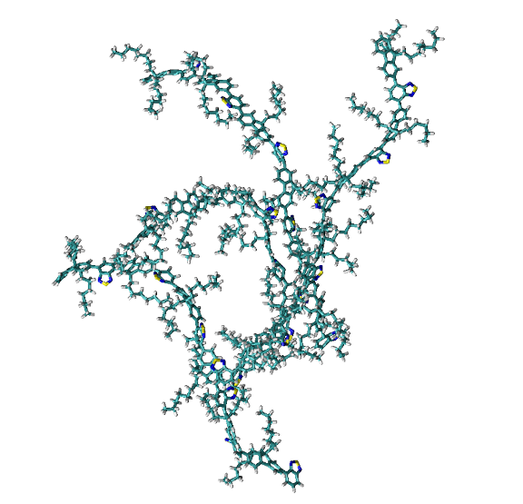

Tutorial on the Usage of the RSA Tool
=====================================

This tutorial illustrates how to use the Ring Stacking Analysis (RSA) tool within the ``pysoftk`` library to identify and analyze $\pi$-$\pi$ stacking interactions in large polymer systems.

Theoretical Background
----------------------

$\pi$-$\pi$ stacking is a non-covalent attractive force between aromatic rings. In polymer science, particularly for organic electronics, these interactions are crucial for charge transport and morphological stability. The RSA tool identifies these events based on two geometric criteria:

1. **Distance Cutoff ($d$):** The minimum distance between any two atoms in two different rings.
2. **Angle Cutoff ($\theta$):** The angle between the normal vectors of the two ring planes.

Preparation
-----------

Before starting any analysis, load the necessary modules.

.. code-block:: python

    from pysoftk.pol_analysis.ring_ring import RSA
    import numpy as np
    import pandas as pd
    import os

    # Optional: silence warnings for cleaner output
    import warnings
    warnings.filterwarnings('ignore')

1. Loading Trajectory Files
---------------------------

Select your trajectory files. It is recommended to use a ``.tpr`` file for the topology and an ``.xtc`` file for the trajectory, though any MDAnalysis-supported file can be used here.

.. code-block:: python

    topology = 'data/f8bt_slab_quench.tpr'
    trajectory = 'data/1_frame_traj.xtc'

The simulation utilized in this tutorial is a large polymer slab. Due to the high atom count, we will demonstrate the analysis on a single frame.

   A simulation box containing 776 F8BT polymer chains.

Defining Analysis Parameters
----------------------------

The RSA class requires minimal user input. Only the angle, distance cutoff, start, stop and step frames are needed, as well as the name of the output file.

.. code-block:: python

    # name output file
    results = 'data/rsa.parquet'
    
    # angle cutoff - angle range (val < ang_c or val > 180 - ang_c). 
    ang_c = 30
    
    # distance cutoff - distance between two rings to be considered stacked
    dist_c = 5.0
    
    # start, stop, and step frames
    start = 0
    stop = 1
    step = 1

Running the Stacking Analysis
-----------------------------

The ``stacking_analysis`` function is highly optimized. It uses **Fragment Templating** to identify rings via RDKit only once per species, **cKDTree** for rapid neighbor searching, and **Numba-accelerated SVD** to calculate plane normals at near-C speeds. 

.. note::
   This version is optimized for polymer connectivity. To handle large systems (e.g., 100k+ atoms), it focuses on Polymer Residue IDs (``pol_resid``) rather than individual atom indices, significantly reducing memory overhead and calculation time.

.. code-block:: python

    rsa = RSA(topology, trajectory)
    df = rsa.stacking_analysis(dist_c, ang_c, start, stop, step, results)

.. parsed-literal::

    Ring Stacking analysis has started...
    Trajectory Progress: 100%|██████████| 1/1 [01:26<00:00, 86.51s/it]
    Function stacking_analysis Took 98.4840 seconds

Exploring the Results
---------------------

The output is stored in a Pandas DataFrame and saved as a Parquet file.

.. code-block:: python

    df_results = 'data/rsa.parquet'
    df = pd.read_parquet(df_results)
    print(df.head())

The ``pol_resid`` column contains pairs of polymer Residue IDs that are participating in at least one stacking interaction.

Visual Inspection
~~~~~~~~~~~~~~~~~

You can generate PDB snapshots of specific interacting pairs to verify the stacking geometry visually.

Network Analysis
----------------

One of the most powerful features of the RSA tool is the ability to extract the **Connected Network**. This identifies clusters of polymers that are all interconnected through stacking interactions.

.. code-block:: python

    # Extract the clusters/networks
    sev_ring = rsa.find_several_rings_stacked(df_results)

    # Print the clusters found in the first frame
    print(sev_ring[0])

The output is a list of sets, where each set contains the Residue IDs of polymers belonging to a single continuous network.

.. parsed-literal::

    [{1, 322, 642, 262, 620, 216}, {480, 2, 68, 10, 20}]

Connectivity Visualization
~~~~~~~~~~~~~~~~~~~~~~~~~~

By visualizing these networks, you can determine if your system has reached percolation (a "giant component") or remains as isolated aggregates.

   A representation of polymers connected by their stacked rings.
