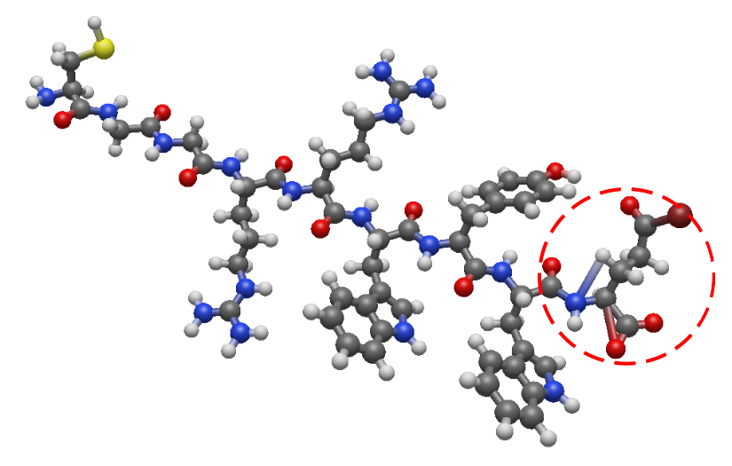
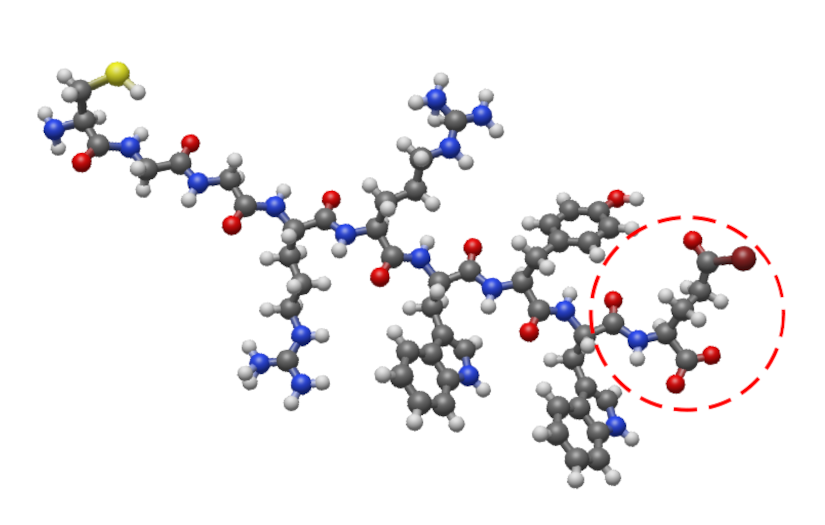

.. include:: /include/links.rst

.. _check_bonds:

=========================================================
Checking Bonds in Molecular files
=========================================================

In order to create/model polymers that the initial structures are provided with a correct bond description. Unfortunately,
due to different reasons, the bonds of the moieties are not correctly described generating conflicts with PySoftK_.

Therefore, we have created an auxiliary function called **check_bonds** located in :mod:`pysoftk.tool.utils\_ob` that
perform an automatic check of bonds and reassigne them based on OpenBabel_ 's connect the dots and perceive bond orders
algorithms. 

For instance, the following molecule displays an incorrect bond between some atoms (highlighted in the figure by a red
circle):

First, we need to import the corresponding modules from PySoftK_ to allow us to read and join the monomers using RDKit_.

.. literalinclude:: scripts/check_bonds.py
   :lines: 1-2

Then, the full path of the file containing the molecule needs to be included (as presented in the snippet), and
subsequently used in the function **check_bonds**, as displayed in the following code:

.. literalinclude:: scripts/check_bonds.py
  :lines: 4-5

Thus, the result of the reconstructed structure (always called with an additional suffix **new**
in the original name) can be shown in the figure below:

