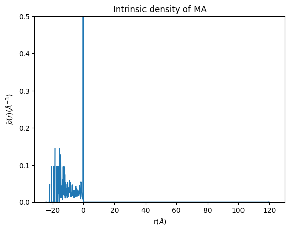
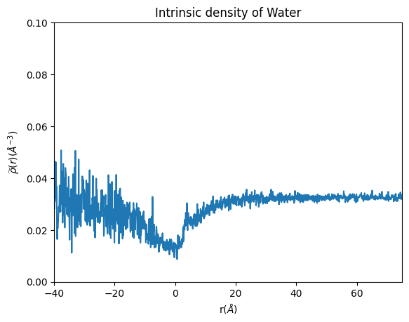

Tutorial on the usage of intrinsic_density_micelle tool
=======================================================

Here, two examples on how to use the intrinsic_density_micelle tool for
the calculation of the distribution of components of a micelle. First we
will show how to use intrinsic_density to calculate the density of the
hydrophobic block of the polymer. Then we will show how to use
intrinsic_density_water to calculate the spherical density of the water
in the simulation

spherical_density tool
----------------------

Before starting any analysis, load the neccesary modules for this class.

.. code:: ipython3

    from  utils_mda import MDA_input
    #from pysoftk.pol_analysis.tools.utils_mda import MDA_input
    from utils_tools import *
    #from pysoftk.pol_analysis.tools.utils_tools import *
    from clustering import SCP
    #from pysoftk.pol_analysis.clustering import SCP
    from make_micelle_whole import micelle_whole
    #from pysoftk.pol_analysis.make_micelle_whole import micelle_whole
    from intrinsic_density_micelle import intrinsic_density
    #from pysoftk.pol_analysis.intrinsic_density_micelle import intrinsic_density
    
    import numpy as np
    import pandas as pd

1. Select your simulation files, it is recommended to use a tpr file for
   the topology and xtc file for the trajectory.

.. code:: ipython3

    topology='data/intrinsic_density_movie.tpr'
    trajectory='data/intrinsic_density_movie.xtc'

2. Run the clustering

.. code:: ipython3

    results_name='data/pictures_tutorial/cyclic_intrinsic_scp_result'
    
    cluster_cutoff = 12
    
    start=0
    stop=10001
    step=1
    
    atom_names=['C02T']
    
    c = SCP(topology, trajectory).spatial_clustering_run(start, stop, step, atom_names, cluster_cutoff, results_name)
    
    
    #load the results from SCP
    resids_total='data/pictures_tutorial/cyclic_intrinsic_scp_result.parquet'

.. parsed-literal::

    100%|██████████████████████████████████████████████████████████████████████████████████████████████████████████████████████████████████████████| 11/11 [00:00<00:00, 22.20it/s]

.. parsed-literal::

    The file data/pictures_tutorial/cyclic_intrinsic_scp_result.parquet has been successfully created.
    Function spatial_clustering_run Took 2.2583 seconds

3. Obtain the largest micelle from the clustering pandas dataframe

.. code:: ipython3

    largest_micelle_resids = micelle_whole(topology, trajectory).obtain_largest_micelle_resids(resids_total)

4. ‘largest_micelle_resids’ is a np.array with the resids of the
   molecules that belong to the same cluster of the steps of the
   trajectory where SCP was ran.

.. code:: ipython3

    largest_micelle_resids

.. parsed-literal::

    [array([ 1,  2,  3,  4,  6,  7,  8, 11, 12, 13, 14, 15, 17, 18, 19]),
     array([ 2,  4,  6,  7, 13, 14, 15, 17, 18, 19, 20]),
     array([ 2,  4,  6,  7, 11, 13, 14, 15, 17, 18, 19, 20]),
     array([ 2,  4,  6,  7, 13, 14, 15, 17, 18, 19, 20]),
     array([ 2,  4,  6,  7, 13, 14, 15, 17, 18, 19, 20]),
     array([ 2,  4,  6,  7, 13, 14, 15, 17, 18, 19, 20]),
     array([ 2,  4,  6,  7, 13, 14, 15, 17, 18, 19, 20]),
     array([ 2,  4,  6,  7, 13, 14, 15, 17, 18, 19]),
     array([ 2,  4,  6,  7, 13, 14, 15, 17, 18, 19, 20]),
     array([ 2,  4,  6,  7, 13, 14, 15, 17, 18, 19, 20]),
     array([ 2,  4,  6,  7, 13, 14, 15, 17, 18, 19, 20])]

Now, let’s obtain the coordinates of the largest micelle made whole
across the periodic boundary conditions (PBC).

5. Let’s define the resname of the molecules that we want to reconstruct
   with the make_whole function. More than one resname can be inputted.
   Note that it should be the resname of the molecules of the
   largest_micelle array.

.. code:: ipython3

    resname=['LIG']

6. Also, the user needs to define the start, step and final step of
   frames in which the user wants to run the analysis on. Note that they
   need to be the same as the ones you ran the SCP clustering on.

.. code:: ipython3

    start=0
    stop=10000
    step=1

7. Obtain the whole coordinates of the micelle. This is key to perform
   the densitity calculation taking properly into account the PBC

.. code:: ipython3

    atom_pos = micelle_whole(topology, trajectory).running_make_cluster_whole(resname, largest_micelle_resids, start, stop, step)

.. parsed-literal::

      0%|                                                                                                                                                   | 0/11 [00:00<?, ?it/s]/home/raquellrdc/Desktop/PhD/pysoftk/alejandro_newest_releast_check/pysoftk_analysis_code/test_final/make_micelle_whole.py:347: FutureWarning: arrays to stack must be passed as a "sequence" type such as list or tuple. Support for non-sequence iterables such as generators is deprecated as of NumPy 1.16 and will raise an error in the future.
      atom_positions_over_trajectory = list(tqdm(map(self.make_cluster_whole, frames, resname, cluster_resids_f[0],
    100%|██████████████████████████████████████████████████████████████████████████████████████████████████████████████████████████████████████████| 11/11 [00:16<00:00,  1.47s/it]

.. parsed-literal::

    Elapsed time for matrix calculation: 17.7199 seconds

Now, atom_pos contains the coordinates of all the atoms of the micelle
made whole at each time step selected. In each array, the first element
is the time frame of the analysis, and the second the positions array

8. We are almost ready for the density calculation. But first, we need
   to define the atoms for which you want to calculate the density. In
   this case, we are going to calculate the density of the hydrophobic
   block of the polymer, so we are going to select the main backbone
   atoms of the hydrophobic block.

.. code:: ipython3

    MA_names = ['C028', 'C024', 'C022', 'C02E', 'C02I', 'C02M', 'C02Q', 'C02U', 'C02Y', 'C00S', 'C00Q', 'C00M', 
                 'C00L', 'C027',  'C023', 'C021',  'C02H',  'C02L',  'C02P',  'C02T', 'C02X', 'C00U',  'C00R',  'C00P', 
                 'O00A', 'O00D', 'O00C', 'O01G', 'O01F', 'O01D', 'O01A', 'O019', 'O016', 'O015', 'O010', 'O012', 
                 'O00B', 'O00E', 'O01I', 'O01H', 'O01C', 'O01B', 'O01E', 'O018', 'O017', 'O014', 'O00Z', 'O013', 
                 'C00O', 'C00W', 'C031', 'C030', 'C02W', 'C02S', 'C02O', 'C02K', 'C02G', 'C02D', 'C026', 'C02B']

9. Also, we need to define the heavy atoms of the solvent. This is
   neccesary even if we are calculating the density of the polymer
   components. This means that we need a trajectory with the solvent for
   the intrinsic density calculation.

.. code:: ipython3

    water_atom=['OW'] #for water the heavy atom is the Oxygen

10. That’s it! We have all the neccesary input files for the spherical
    density calculation of the hydrophobic component. This function
    outputs two arrays, the first one are the density values and the
    second one are the binned space values. This function outputs these
    two arrays for easier plotting.

.. code:: ipython3

    density_whole_MA, binned_space = intrinsic_density(topology, trajectory).run_intrinsic_density(largest_micelle_resids, atom_pos, MA_names, MA_names, water_atom, start, stop, step)

.. parsed-literal::

      0%|                                                                                                                                                   | 0/11 [00:00<?, ?it/s]/home/raquellrdc/Desktop/PhD/polymer/pysoftwhere/pySoftWhere/pySoftWhere/ICSI/icsi.py:85: RuntimeWarning: Mean of empty slice
      interface_vals[i][j]=np.nanmean([interface_vals[divmod(ip,len(interface_vals))[1]][divmod(jp,len(interface_vals))[1]] for ip,jp in product(n_i,n_j)])
    100%|██████████████████████████████████████████████████████████████████████████████████████████████████████████████████████████████████████████| 11/11 [00:34<00:00,  3.12s/it]
    /home/raquellrdc/Desktop/PhD/pysoftk/alejandro_newest_releast_check/pysoftk_analysis_code/test_final/intrinsic_density_micelle.py:280: RuntimeWarning: divide by zero encountered in divide
      final_density=intrinsic_density_profile/S_bar
    /home/raquellrdc/Desktop/PhD/pysoftk/alejandro_newest_releast_check/pysoftk_analysis_code/test_final/intrinsic_density_micelle.py:280: RuntimeWarning: invalid value encountered in divide
      final_density=intrinsic_density_profile/S_bar

Note that MA_names is specified twice. This is because for the intrinsic
density you need to define the atoms that belong to the (hydrophobic)
core of the micelle. So the first specification is used to describe the
atoms in the core, and the second time to define the atoms you want to
calculate the density of. You do not need ot include all atoms in the
core, you can only input at least one atom of the backbone chain per
hydrophobic monomer

Also, note that we have left the values to be binned as the default one,
but you may want to change them depending on your system

Now, let’s plot the density to see how it looks.

.. code:: ipython3

    import matplotlib.pyplot as plt
    
    plt.plot(binned_space, density_whole_MA)
    
    plt.xlabel('r($\AA$)')
    plt.ylabel('$\widetilde{\u03C1}(r)$($\AA^{-3}$)')
    plt.ylim(0, 0.5) #the peak at the interface can be quite high, so this limit is to properly observe the distribution of the component within the micelle
    plt.title('Intrinsic density of MA')

.. parsed-literal::

    Text(0.5, 1.0, 'Intrinsic density of MA')

Remember that the more data (frames and atoms) that you input, the
smoother your density will be

intrinsic_density_water tool
----------------------------

Now, let’s calculate the density of the water in the same simulation.
For this we need a different tool, intrinsic_density_water. We are going
to use the same trajectory, so no need to load it again. We just need to
start by importing the intrinsic_density_water_micelle class

.. code:: ipython3

    #from pysoftk.pol_analysis.intrinsic_density_water_micelle  import intrinsic_density_water
    from intrinsic_density_water_micelle import intrinsic_density_water

We have already obtained the resids of the polymer belonging to the
largest micelle as well as the atom positions of the micelle made whole
across the PBC. So the only inputs needed for this function are the name
of the solvant atoms that we want to calculate the density of. In this
case the solvent is water, so we select the oxygen atoms.

.. code:: ipython3

    water_atoms=['OW']

We are ready to run the density of the water! - This will take longer,
since there are many water atoms in the system

.. code:: ipython3

    density_whole_water, binned_space_water = intrinsic_density_water(topology, trajectory).run_intrinsic_density(largest_micelle_resids, atom_pos, water_atoms, MA_names, water_atoms, start, stop, step)

.. parsed-literal::

    100%|██████████████████████████████████████████████████████████████████████████████████████████████████████████████████████████████████████████| 11/11 [02:58<00:00, 16.22s/it]
    /home/raquellrdc/Desktop/PhD/pysoftk/alejandro_newest_releast_check/pysoftk_analysis_code/test_final/intrinsic_density_water_micelle.py:332: RuntimeWarning: divide by zero encountered in divide
      final_density=intrinsic_density_profile/S_bar
    /home/raquellrdc/Desktop/PhD/pysoftk/alejandro_newest_releast_check/pysoftk_analysis_code/test_final/intrinsic_density_water_micelle.py:332: RuntimeWarning: invalid value encountered in divide
      final_density=intrinsic_density_profile/S_bar

At this point, it is also needed to specify the core of the micelle,
since the intrinsic density is estimated with respect to the core-shell
interface. That is why we need to again input ‘MA_names’ that contains
some of the atoms of the hydrophobic block of the polymer.

Now let’s plot it to see how it looks

.. code:: ipython3

    plt.plot(binned_space_water, density_whole_water)
    
    plt.xlabel('r($\AA$)')
    plt.ylabel('$\widetilde{\u03C1}(r)$($\AA^{-3}$)')
    plt.ylim(0, 0.1)
    plt.xlim(-40, 75) # the densities of the far end reach very high values that are just artifacts of the calculations of the intrinsic density performed very far away from the micelle.
    plt.title('Intrinsic density of Water')

.. parsed-literal::

    Text(0.5, 1.0, 'Intrinsic density of Water')

Looks like this micelle is not very stable since it has a lot of water
in the core!
