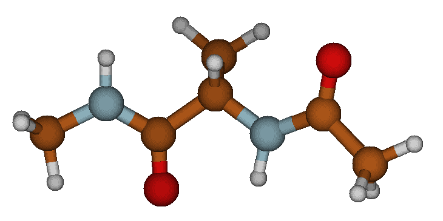
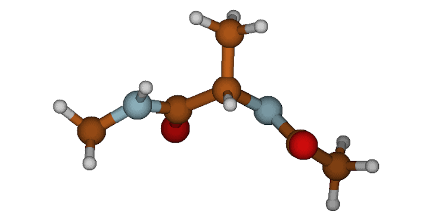
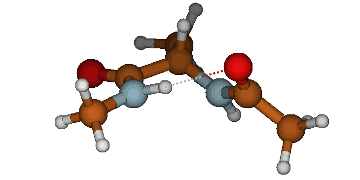

.. _kinetic_clustering_tutorial:

=================================================
Automated Kinetic State Discovery with PySoftK
=================================================

This tutorial demonstrates how to process a raw Molecular Dynamics trajectory (e.g., from xTB), automatically identify the molecular backbone, filter out thermal noise, and cluster the distinct kinetic states using tICA and HDBSCAN. Finally, we will mathematically analyze and interactively visualize the discovered conformations.

Prerequisites
-------------
Make sure you have installed PySoftK and its dependencies. If you are running this in a Jupyter Notebook or Google Colab, you can install it directly:

.. code-block:: bash

    git clone https://github.com/alejandrosantanabonilla/pysoftk
    cd pysoftk
    pip install .
    pip install py3Dmol MDAnalysis

Step 1: Define Data Paths
-------------------------
For this tutorial, the required trajectory (``xtb.xyz``) and topology (``topology.pdb``) of Alanine Dipeptide are located in the ``topologies_tutorials/data/`` folder of the repository.

.. code-block:: python

    import os

    data_dir = "topologies_tutorials/data" 
    topology_file = os.path.join(data_dir, "topology.pdb")
    trajectory_file = os.path.join(data_dir, "xtb.xyz")
    output_conformers = os.path.join(data_dir, "representative_conformers.pdb")

    if not os.path.exists(topology_file):
        print(f"Warning: Could not find {topology_file}.")
    else:
        print(f"Topology found at: {topology_file}")

    if not os.path.exists(trajectory_file):
        print(f"Warning: Could not find {trajectory_file}.")
    else:
        print(f"Trajectory found at: {trajectory_file}")

Step 2: Run the Kinetic Clustering Pipeline
-------------------------------------------
We will use PySoftK to automatically extract the dominant conformations. 

.. code-block:: python

    from pysoftk.pol_analysis.kinetic_clustering import AutomatedKineticClustering

    print("Loading trajectory data...")
    app = AutomatedKineticClustering(topology_file, trajectory_file)

    # Identify the structural core (Top 60% centrality, filtering out fast-moving hydrogens)
    app.define_backbone_by_centrality(percentile=60)

    # Build contact maps (4.5 Å cutoff for H-bonding in small peptides)
    app.extract_contact_maps(r_cutoff=4.5)

    # Project and cluster (Lag time of 5 frames)
    embedding, labels = app.run_tica_clustering(lag_time_frames=5, n_components=2, min_cs=10)

    # Save the physical frames closest to the cluster centers
    app.export_representative_states(output_conformers)

Step 3: Mathematical Analysis of Discovered States
--------------------------------------------------
We can use MDAnalysis to measure the Ramachandran dihedral angles and the intramolecular hydrogen bond distance to classify the discovered states mathematically.

.. code-block:: python

    import numpy as np
    import MDAnalysis as mda
    from MDAnalysis.lib.distances import calc_dihedrals

    print(f"--- Analyzing {output_conformers} ---")
    u = mda.Universe(output_conformers)

    # Atom indices for Alanine Dipeptide (0-based)
    phi_indices = [4, 6, 8, 14] # C(ACE) - N - CA - C
    psi_indices = [6, 8, 14, 16] # N - CA - C - N(NME)
    o_idx, h_idx = 5, 17 # O(ACE) to H(NME) for H-Bond

    for ts in u.trajectory:
        # Extract coordinates
        phi_coords = u.atoms[phi_indices].positions
        psi_coords = u.atoms[psi_indices].positions
        
        # Calculate Dihedrals and grab the raw float value using [0]
        phi_angle = np.rad2deg(calc_dihedrals(*phi_coords))[0]
        psi_angle = np.rad2deg(calc_dihedrals(*psi_coords))[0]
        
        # Calculate H-Bond Distance
        hbond_dist = np.linalg.norm(u.atoms[o_idx].position - u.atoms[h_idx].position)
        
        # Classify state based on precise xTB Ramachandran boundaries
        if hbond_dist < 2.5:
            state_name = "Alpha-Helix (aR / C7eq)"
        elif phi_angle < -130 and psi_angle > 100:
            state_name = "Beta-Sheet (C5)"
        else:
            state_name = "Polyproline II (PII)"

        print(f"State {ts.frame + 1}: {state_name}")
        print(f"  -> Phi (φ): {phi_angle:.1f}°")
        print(f"  -> Psi (ψ): {psi_angle:.1f}°")
        print(f"  -> O-H Distance: {hbond_dist:.2f} Å\n")

Step 4: The Three Discovered Phases
-----------------------------------
The algorithm successfully isolates three physically distinct metastable states from the trajectory. Below are the structural representations of these kinetic basins:

**1. The Beta-Sheet (C5) State**
This is the fully extended conformation where the backbone is stretched out. The oxygen on the acetyl group and the hydrogen on the N-methyl group point in opposite directions, preventing any intramolecular hydrogen bonding.

   The extended Beta-Sheet (C5) conformation.

**2. The Polyproline II (PII) State**
Similar to the beta-sheet, the psi angle is highly extended, but the phi angle has twisted significantly inward. This twisted-extended state is a signature, highly-populated basin for unfolded peptides.

   The twisted Polyproline II (PII) conformation.

**3. The Alpha-Helix (aR / C7eq) State**
The molecule curls back on itself to form a closed ring. This state is locked into place by a strong, ~2.0 Å intramolecular hydrogen bond between the Acetyl oxygen and the N-methylamide hydrogen.

   The folded Alpha-Helix (aR / C7eq) conformation featuring a strong intramolecular hydrogen bond.

Step 5: Interactive 3D Visualization
------------------------------------
Finally, use ``py3Dmol`` to load the generated PDB file and visualize the folding transitions right in your Jupyter environment.

.. code-block:: python

    import py3Dmol

    print(f"--- Visualizing {output_conformers} ---")

    # Read the generated PDB file containing our 3 states
    with open(output_conformers, 'r') as f:
        pdb_data = f.read()

    # Initialize the 3D viewer
    view = py3Dmol.view(width=800, height=400)
    view.addModelsAsFrames(pdb_data)

    # Style the molecule
    view.setStyle({'stick': {'radius': 0.15}, 'sphere': {'radius': 0.4}})

    # Animate through the states
    view.animate({'loop': 'forward', 'step': 1000}) 
    view.zoomTo()
    view.show()
