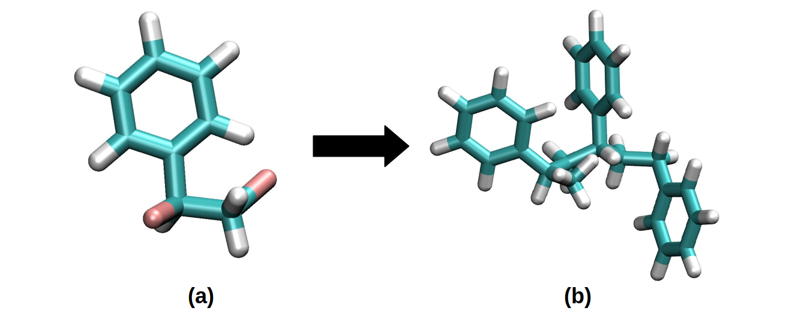

.. include:: /include/links.rst

.. _monomer_polymers:

=========================================================
From single molecules to polymers using PySoftK
=========================================================

PySoftK_ enables to create Polymers from a single monomer. To do so, the user needs to highligthing the positions where the merging process will take 
place, using a place-holder atom.   

An example is in this section presented using a Styrene molecule. By using a common visualization program (such as VMD_), the functionalized molecule is 
presented below:

**(a)** Represents a functionalized single Styrene molecule in which two Bromine atoms are used as place-holders for bonding formation. **(b)** A Styrene 
polymer formed with a 3-unit repetition. 

The process to build these kind of polymers is presented in this snapshot:

.. code-block:: python

   from rdkit import Chem
   from rdkit.Chem import AllChem

   from pysoftk.linear_polymer.linear_polymer import *
   from pysoftk.format_printers.format_mol import *

   a=Chem.MolFromSmiles('c1c([C@@H](CBr)Br)cccc1')
   
   #Embedding is needed for being parsed as a pysoftk.object
   AllChem.EmbedMolecule(a)
   
   new=Lp(a,"Br",2,shift=1.25).linear_polymer("MMFF",350)
   Fmt(new).xyz_print("styrene_pol.xyz")
   
   
The Styrene molecule (**a**) is initially declared using SMILES format. The molecule has been embedded using one the methods available in RDKit_ and then 
parsed to :mod:`pysoftk.linear\_polymer.super\_linear_polymer` to create an initial polymer structure. 

Stereochemistry issues
--------------------------

In some cases, the used monomer exhibits complicated three-dimensional structures which are sometimes not well described using SMILES format. As an 
example, the following molecule:

.. code-block:: python

   a=Chem.MolFromSmiles('[C@H](CBr)(OBr)C')

Produces the following error, when directly parse to PySoftK_:

.. code-block:: bash
  
   ValueError: Bad Conformer Id

This indicates that the molecule has many possible three-dimensional representations. This problem can be solved, by creating a first set of three-
dimensional coordinates in the following way:

.. code-block:: python

   from rdkit import Chem
   from rdkit.Chem import AllChem

   from pysoftk.linear_polymer.linear_polymer import *
   from pysoftk.format_printers.format_mol import *

   #Creatin a 3-D representation by inactivating the isomericSmiles option from RDKit.
   a=Chem.MolFromSmiles('[C@H](CBr)(OBr)C')
   b=Chem.MolToSmiles(a, isomericSmiles=False)
   c=Chem.MolFromSmiles(b)

   # Original Embedding
   AllChem.EmbedMolecule(c)

   new=Lp(c,"Br",4,shift=1.25).linear_polymer("MMFF",350)
   Fmt(new).xyz_print("solved.xyz")
   
Enabling the creation of the corresponding 4-unit polymer. 
