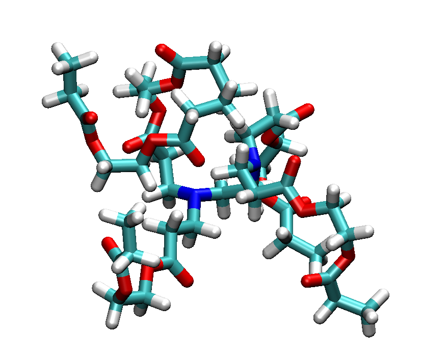

.. include:: /include/links.rst

.. _polymer_branched:

=================================================================
Creating branched Polymers
=================================================================

Branched polymers are another topology that is enabled in PySoftK_. Generally, branched polymers are a set of secondary polymer chains linked to a primary backbone. PySoftK_ builds this topology by employing the user-supplied atomic placeholder as an indicator of the number of branch points from the primary backbone present in this structure. Thus, for instance, a backbone with four placeholders will generate a model where four branches (arms) are attached at the regions on the backbone indicated by the user. The command **Bd(core,arm,atom).branched_polymer(FF,ff_iter)** is used to generate a branched polymer with a backbone of core and arms described by arm.

The inputted structures for core and arm can be simple monomers and therefore inputted as previously discussed or they can be resultant structures from any of the other commands and then inputted into the branched function. Incorporation can be carried out using the current PySoftK_ structure as part of the module topology  :mod:`pysoftk.topologies.branched` function.

First, we need to import the initial molecules and read it using RDKit_, as shownin the following snippet:

.. literalinclude:: scripts/branched.py
   :lines: 1-5

Then, we can create a branched topology, by using the following commands:

.. literalinclude:: scripts/branched.py
   :lines: 7-9

The new molecular unit (stored in the variable **bran**) can be used to replicate and form a polymer with a given desired architecture. To print the structure in XYZ format, one needs to add the following lines of conde as can be seen in this snipet:

.. literalinclude:: scripts/branched.py
   :lines: 11-12

By using a common visualization program (such as VMD_), the built structure **branched.xyz** can be displayed and the result as presented above

   **Figure** Branched polymer with 4 arms. 
