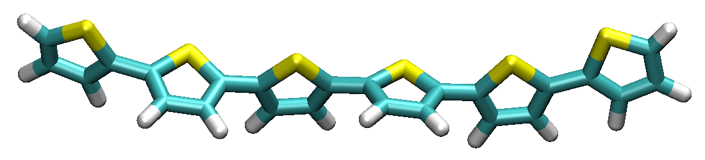

.. include:: /include/links.rst

.. _polymer_chains:

=================================================================
Creating chains of Polymers
=================================================================

Let's try to create our first polymer by merging two similar molecules using the :mod:`pysoftk.linear\_polymer.super\_linear_polymer` function.

First, we need to import the corresponding modules from PySoftK_ allowing us to merge the initial molecules (i.e create a super-monomer) and read them using RDKit_

.. literalinclude:: scripts/polymer_chains.py
   :lines: 1-6

Then, the molecules are created (using SMILES format) and read
using the following lines of code:

.. literalinclude:: scripts/polymer_chains.py
   :lines: 11-12

Once the initial molecular units are defined, we can create
a polymer (i.e a super-monomer in PySoftK_ language)
as indicated in the following lines:

.. literalinclude:: scripts/polymer_chains.py
   :lines: 14-15

The new molecular unit (stored in the variable **k**) can be
used to replicate and form a polymer with a given desired
number of units (in this case 3) and printed in XYZ format,
as can be seen in this code snipet:

.. literalinclude:: scripts/polymer_chains.py
   :lines: 17-18

By using a common visualization program (such as VMD_), the built
structure **polymer_1_2.xyz** can be displayed and the result
as presented above

   **Figure** Linear polymer with a 3-unit repetition. 
