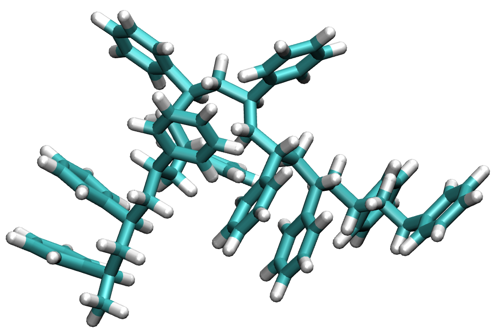
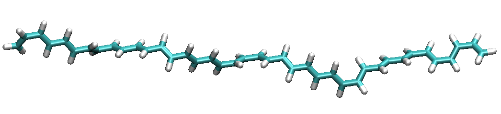

.. include:: /include/links.rst

.. _linear_lrp:

Recursive linear polymer generation with Lpr
==============================================

The ``Lpr`` class in the :mod:`pysoftk.linear_polymer.linear_polymer` module provides a powerful way to generate linear polymers from repeating monomer units. This tutorial will guide you through its usage, explaining the key parameters and options. The ``Lpr`` class is initialized with a starting SMILES string, a dictionary of replacements, and the maximum number of repetitions.

Let's start with a simple example of generating polystyrene.

.. code-block:: python

    from pysoftk.linear_polymer.linear_polymer import Lpr

    smiles = "CC(c1ccccc1){R}"
    replacements = {"R": "CC(c1ccccc1){R}"}
    final_replacement = ""
    lpr_instance = Lpr(smiles, replacements, max_repetitions=10, final_replacement=final_replacement)
    result = lpr_instance.generate_recursive_smiles(force_field="MMFF", relax_iterations=250, rot_steps=1)
    print(result)

This is the result of the recursive implementation:
    

   **Figure** recursive linear polymer with 10 styrene units.

    
1.  **Initialization:**
    * ``smiles = "CC(c1ccccc1){R}"``: This is the starting SMILES string. The ``{R}`` placeholder indicates the point where the polymer chain will extend.
    * ``replacements = {"R": "CC(c1ccccc1){R}"}``: This dictionary defines the replacement rule. The ``{R}`` placeholder in the replacement string is crucial for recursive polymer growth.
    * ``max_repetitions=10``: This specifies the number of times the replacement rule will be applied, determining the polymer's length.
    * ``final_replacement = ""``: This allows a final modification to the end of the polymer chain. In this case, there's no final replacement.
    * ``lpr_instance = Lpr(smiles, replacements, max_repetitions=10, final_replacement=final_replacement)``: This creates an instance of the Lpr class.

2.  **Polymer Generation:**
    * ``result = lpr_instance.generate_recursive_smiles(force_field="MMFF", relax_iterations=250, rot_steps=1)``: This generates the polymer using the specified parameters.
    * ``force_field="MMFF"``: Specifies the force field to use for geometry optimization.
    * ``relax_iterations=250``: Sets the number of iterations for geometry optimization.
    * ``rot_steps=1``: Sets the number of rotational steps.
    * ``print(result)``: Prints the generated molecule.

**Lpr Class Parameters**

The Lpr class contains the following parameters:

* **`smiles` (str):** The starting SMILES string.
* **`replacements` (dict):** A dictionary of replacement rules.
* **`max_repetitions` (int):** The maximum number of repetitions.
* **`final_replacement` (str, optional):** A final replacement string. Defaults to an empty string.

**generate_recursive_smiles` Method Parameters**

The generative_recursive_smiles function has the following parameters:

* **`force_field` (str, optional):** The force field to use for geometry optimization (e.g., "MMFF", "UFF"). Defaults to None (no optimization).
* **`relax_iterations` (int, optional):** The number of iterations for geometry optimization. Defaults to 0.
* **`rot_steps` (int, optional):** The number of rotational steps. Defaults to 1.

**Further notes:**

* The ``{R}`` placeholder is essential for defining the polymer chain's growth points.
* Geometry optimization can be computationally intensive, especially for large polymers. Adjust ``relax_iterations`` accordingly.
* Ensure that the starting SMILES string and replacement rules are valid.
* It is advised to use smaller values for max_repetitions and relax_iterations when testing, and then increase them for the final run.

Here's an example of generating polyethylene:

.. code-block:: python

    from pysoftk.linear_polymer.linear_polymer import Lpr

    smiles = "C=C{R}"
    replacements = {"R": "C=C{R}"}
    final_replacement = ""
    lpr_instance = Lpr(smiles, replacements, max_repetitions=20, final_replacement=final_replacement)
    result = lpr_instance.generate_recursive_smiles(force_field="MMFF", relax_iterations=250, rot_steps=1)

    print(result)

   **Figure** recursive linear polymer with 10 ethylene units.
    
In this example, we generate a longer polyethylene chain using a higher ``max_repetitions`` value. Experiment with different starting SMILES strings and replacement rules to create various linear polymers. Adjust the optimization parameters to fine-tune the resulting structures. This documentation should help you get started with using the Lrp class.
