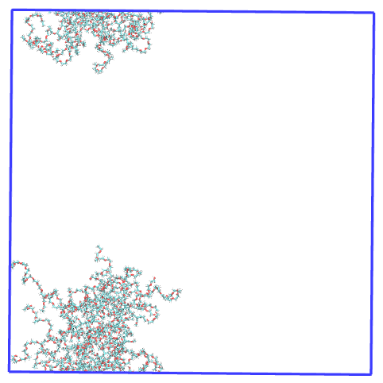

Case example of MDAnalysis vs Pysoftk’s rgyr_micelle
====================================================

This Jupyter notebook aims to illustrate how PySoftK provides an
enhanced algorithm to compute the radius of gyration (rgyr) of a
simulates system that has been broken across the periodic boundary
conditions (PBC). Using the MDAnalysis option pbc=True parameters of the
implemented rgyr equation. Our appraoch (rgyr_micelle) uses MDAnalysis
rgyr function applied to the whole coordinates, so that the PBC are
taken into account properly. This leads to a more appropriate
calculation of the rgyr of the micelle.

We are going to perform the rgyr analysis on a micelle that is broken
aross the different PBC dimensions. This is the first frame of the
trajectory visualized with VMD. There are two polymer aggregates in the
simulation. We are only interested in the largest one, so we will first
need to get the polymer resid of the micelle we want to run the analysis
on.

.. figure:: images/rgyr_initial_all_pol.png
   :alt: Image Alt Text

   Image Alt Text

Thus, we firstly load the trajectory

.. code:: ipython3

    topology='data/pictures_tutorial/movie_rgyr_cyclic.tpr'
    trajectory='data/pictures_tutorial/movie_rgyr_cyclic.xtc'

We need to obtain the resids of the polymers that belong to the largest
micelle, since this are the ones that we want to run the analysis on

.. code:: ipython3

    from  utils_mda import MDA_input
    #from pysoftk.pol_analysis.tools.utils_mda import MDA_input
    from utils_tools import *
    #from pysoftk.pol_analysis.tools.utils_tools import *
    from clustering import SCP
    #from pysoftk.pol_analysis.clustering import SCP
    from make_micelle_whole import micelle_whole
    #from pysoftk.pol_analysis.make_micelle_whole import micelle_whole
    from rgyr_micelle import rgyr
    #from pysoftk.pol_analysis.rgyr_micelle import rgyr
    
    import numpy as np
    import pandas as pd

.. code:: ipython3

    results_name='data/pictures_tutorial/rgyr_comparisson_scp_result'
    
    atom_names= ['O014', 'O00C']
    
    cluster_cutoff = 12
    
    start=0
    stop=20001
    step=1
    
    
    #running SCP
    c = SCP(topology, trajectory).spatial_clustering_run(start, stop, step, atom_names, cluster_cutoff, results_name)

.. parsed-literal::

    100%|██████████████████████████████████████████████████████████████████████████████████████████████████████████████████████████████████████████| 11/11 [00:00<00:00, 14.08it/s]

.. parsed-literal::

    The file data/pictures_tutorial/rgyr_comparisson_scp_result.parquet has been successfully created.
    Function spatial_clustering_run Took 2.5011 seconds

The results from the clustering are:

.. code:: ipython3

    #the result from SCP
    resids_total = 'data/pictures_tutorial/rgyr_comparisson_scp_result.parquet'

Now, let’s obtain the largest micelle resids in every time step selected

.. code:: ipython3

    largest_micelle_resids = micelle_whole(topology, trajectory).obtain_largest_micelle_resids(resids_total)
    
    print(largest_micelle_resids)

.. parsed-literal::

    [array([ 1,  2,  3,  4,  7,  8, 10, 11, 12, 14, 15, 16, 17, 20]), array([ 1,  2,  3,  4,  7, 10, 11, 12, 14, 15, 16, 17, 20]), array([ 1,  2,  4,  7,  8, 10, 11, 14, 15, 20]), array([ 1,  2,  3,  4,  7,  8, 10, 11, 12, 14, 15, 16, 20]), array([ 1,  2,  3,  4,  7,  8, 10, 11, 12, 14, 15, 16]), array([ 1,  2,  3,  4,  7,  8, 10, 11, 12, 14, 15, 16, 20]), array([ 1,  2,  3,  4,  7,  8, 10, 11, 12, 14, 15, 16, 20]), array([ 1,  2,  3,  4,  7,  8, 10, 11, 12, 14, 15, 16, 20]), array([ 1,  2,  3,  4,  7,  8, 10, 11, 12, 14, 15, 16, 17, 20]), array([ 1,  2,  3,  4,  8, 10, 11, 12, 14, 15, 16, 17, 20]), array([ 1,  2,  3,  4,  7,  8, 10, 11, 12, 14, 15, 16, 17, 20])]

This is the resid selection for the first frame visualized on VMD,
clearly it has selected all polymers in the largest micelle! |Image Alt
Text|

Now that we know the resids, we can start our analysis!

MDAnalysis rgyr pbc=True
------------------------

Before starting any analysis, load the neccesary modules.

.. code:: ipython3

    import MDAnalysis as mda 
    import MDAnalysis.analysis.distances
    import numpy as np
    import matplotlib.patches as mpatches
    import itertools
    import MDAnalysis.transformations as trans
    import matplotlib.pyplot as plt
    from tqdm.auto import tqdm

Load the trajectory on MDAnalysis

.. code:: ipython3

    
    u=mda.Universe(topology, trajectory)

Calculate the micelle rgyr for all the analysis frames using the
MDAnalysis radius_of_gyration() function

.. code:: ipython3

    
    polymer = u.select_atoms('resname S1P1') #resname of the polymers in the simulation
    
    
    radius_of_gyration_mdanalysis = [] #list where we will store the radius of gyration at each time step
    
    
    time= []
    
    for ts in tqdm(u.trajectory):
        
       
        
        #creating a list with the resids at each time step so that we can select them at time step, since the number
        #of polymers in the micelle vary over time#####################
        ind = []
        
        
        for item in largest_micelle_resids[int(ts.frame)]:
            
            ind.append(str(item) +' ')
            
            
        ind_f = ' '.join(ind)
        
        ##############################################################
        
        
        
        micelle = polymer.select_atoms('resid ' + str(ind_f)) #selecting the polymers in the micelle at each step
        
        
        radius_of_gyration_mdanalysis.append(micelle.radius_of_gyration(pbc=True)) #rgyr calculation
        
        #creating a time list
        
        time.append(u.trajectory.time/1000000)
        
        
        
        
    radius_of_gyration_mdanalysis = np.array(radius_of_gyration_mdanalysis)    
    
        
    time = np.array(time)

.. parsed-literal::

    100%|██████████████████████████████████████████████████████████████████████████████████████████████████████████████████████████████████████████| 11/11 [00:00<00:00, 57.70it/s]

.. code:: ipython3

    
    plt.plot(time, radius_of_gyration_mdanalysis)
    plt.xlabel('Time (\u03BCs)')
    plt.ylabel(r"$R_G$ ($\AA$)")
    plt.ylim(20, 120)
    plt.title('$R_G$ of micelle calculated with MDAanalysis')

.. parsed-literal::

    Text(0.5, 1.0, '$R_G$ of micelle calculated with MDAanalysis')

It looks like the rgyr of the micelle calculated with the rgyr
MDAnalysis function when this micelle is broken across the PBC outputs
values that considerable oscillate, leading us to be skeptic about these
results. Let’s see what PySoftK rgyr tool reports!

PySoftK ’s rgyr_micelle
-----------------------

We have already loaded all the modules and calculated the resids of the
largest micelle. We only need to obtain the positions of the whole
structure to run the rgyr calculation.

.. code:: ipython3

    #select the resname of the polymers
    resname=['S1P1'] 
    
    #run to obtain the whole positions
    atom_pos = micelle_whole(topology, trajectory).running_make_cluster_whole(resname, largest_micelle_resids, start, stop, step)

.. parsed-literal::

      0%|                                                                                                                                                   | 0/11 [00:00<?, ?it/s]/home/raquellrdc/Desktop/PhD/pysoftk/alejandro_newest_releast_check/pysoftk_analysis_code/test_final/make_micelle_whole.py:347: FutureWarning: arrays to stack must be passed as a "sequence" type such as list or tuple. Support for non-sequence iterables such as generators is deprecated as of NumPy 1.16 and will raise an error in the future.
      atom_positions_over_trajectory = list(tqdm(map(self.make_cluster_whole, frames, resname, cluster_resids_f[0],
    100%|██████████████████████████████████████████████████████████████████████████████████████████████████████████████████████████████████████████| 11/11 [00:14<00:00,  1.32s/it]

.. parsed-literal::

    Elapsed time for matrix calculation: 15.8911 seconds

Now, we have all the neccesary inputs to calculate the radius of
gyration of the micelle. Let’s run the function!

.. code:: ipython3

    rgyr_micelle_whole_pysoftk = rgyr(topology, trajectory).running_rgyr(largest_micelle_resids, atom_pos, start, stop, step)

.. parsed-literal::

    100%|█████████████████████████████████████████████████████████████████████████████████████████████████████████████████████████████████████████| 11/11 [00:00<00:00, 310.37it/s]

Let’s see how the output looks like:

.. code:: ipython3

    
    plt.plot(time, rgyr_micelle_whole_pysoftk)
    plt.xlabel('Time (\u03BCs)')
    plt.ylabel(r"$R_G$ ($\AA$)")
    plt.ylim(20, 120)
    plt.title('$R_G$ of micelle calculated with PySoftK')

.. parsed-literal::

    Text(0.5, 1.0, '$R_G$ of micelle calculated with PySoftK')

For clarity, this is how the micelle made whole looks in the first step
of the trajectory:

.. figure:: images/rgyr_result_arrow.png
   :alt: Image Alt Text

Therefore, it is clear that PySoftK is able to properly take into
account the PBC when calculating the radius of gyration expanding the
current MDAnalysis’ implementation.
