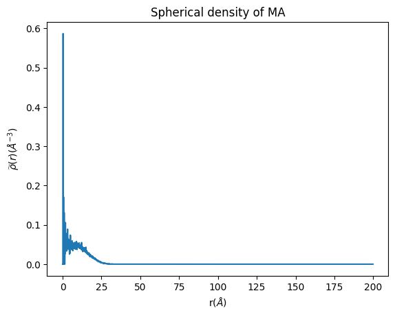
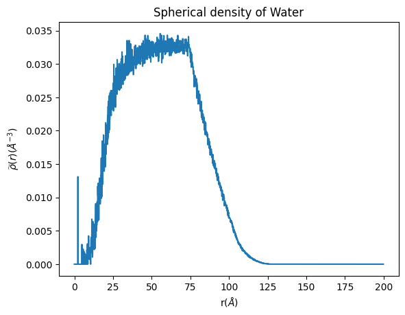

Tutorial on the usage of spherical_density tool
===============================================

Here, two examples on how to use the spherical_density tool for the
calculation of the distribution of components of a micelle. First we
will show how to use spherical_density to calculate the density of the
hydrophobic block of the polymer. Then we will show how to use
spherical_density_water to calculate the spherical density of the water
in the simulation

spherical_density tool
----------------------

Before starting any analysis, load the neccesary modules for this class.

.. code:: ipython3

    from  utils_mda import MDA_input
    #from pysoftk.pol_analysis.tools.utils_mda import MDA_input
    from utils_tools import *
    #from pysoftk.pol_analysis.tools.utils_tools import *
    from clustering import SCP
    #from pysoftk.pol_analysis.clustering import SCP
    from make_micelle_whole import micelle_whole
    #from pysoftk.pol_analysis.make_micelle_whole import micelle_whole
    from spherical_density import spherical_density
    #from pysoftk.pol_analysis.spherical_density import spherical_density
    
    import numpy as np
    import pandas as pd

.. parsed-literal::

    /home/raquellrdc/Desktop/PhD/mda_umap/lib/python3.10/site-packages/tqdm/auto.py:21: TqdmWarning: IProgress not found. Please update jupyter and ipywidgets. See https://ipywidgets.readthedocs.io/en/stable/user_install.html
      from .autonotebook import tqdm as notebook_tqdm

1. Select your simulation files, it is recommended to use a tpr file for
   the topology and xtc file for the trajectory.

.. code:: ipython3

    topology='data/spherical_density.tpr'
    trajectory='data/spherical_density.xtc'

2. Import the clustering data from SCP function

.. code:: ipython3

    resids_total='data/spherical.parquet'

3. Obtain the largest micelle from the clustering pandas dataframe

.. code:: ipython3

    largest_micelle_resids = micelle_whole(topology, trajectory).obtain_largest_micelle_resids(resids_total)

4. ‘largest_micelle_resids’ is a np.array with the resids of the
   molecules that belong to the same cluster of the steps of the
   trajectory where SCP was ran.

.. code:: ipython3

    largest_micelle_resids

.. parsed-literal::

    [array([ 1,  2,  3,  4,  5,  6,  7,  8,  9, 10, 11, 12, 13, 14, 15, 16, 17,
            18, 20]),
     array([ 1,  2,  3,  4,  5,  6,  7,  8,  9, 10, 11, 12, 13, 14, 15, 16, 17,
            18, 19, 20]),
     array([ 1,  2,  3,  4,  5,  6,  7,  8,  9, 10, 11, 12, 13, 14, 15, 16, 17,
            18, 19, 20]),
     array([ 1,  2,  3,  4,  5,  6,  7,  8,  9, 10, 11, 12, 13, 14, 15, 16, 17,
            18, 19, 20]),
     array([ 1,  2,  3,  4,  5,  6,  7,  8,  9, 10, 11, 12, 13, 14, 15, 16, 17,
            18, 19, 20]),
     array([ 1,  2,  3,  4,  5,  6,  7,  8,  9, 10, 11, 12, 13, 14, 15, 16, 17,
            18, 19, 20]),
     array([ 1,  2,  3,  4,  5,  6,  7,  8,  9, 10, 11, 12, 13, 14, 15, 16, 17,
            18, 19, 20]),
     array([ 1,  2,  3,  4,  5,  6,  7,  8,  9, 10, 11, 12, 13, 14, 15, 16, 17,
            18, 19, 20]),
     array([ 1,  2,  3,  4,  5,  6,  7,  8,  9, 10, 11, 12, 13, 14, 15, 16, 17,
            18, 19, 20]),
     array([ 1,  2,  3,  4,  5,  6,  7,  8,  9, 10, 11, 12, 13, 14, 15, 16, 17,
            18, 19, 20]),
     array([ 1,  2,  3,  4,  5,  6,  7,  8,  9, 10, 11, 12, 13, 14, 15, 16, 17,
            18, 19, 20])]

Now, let’s obtain the coordinates of the largest micelle made whole
across the pbc

5. Let’s define the resname of the molecules that we want to make whole.
   More than one resname can be inputted. Note that it should be the
   resname of the molecules of the largest_micelle array.

.. code:: ipython3

    resname=['LIG']

6. Also, define the start, step and end point of the trajectory frames
   that you want to run the analysis on. Note that they need to be the
   same as the ones you ran the SCP clustering on.

.. code:: ipython3

    start=0
    stop=1000
    step=2

7. Obtain the whole coordinates of the micelle. This is key to perform
   the densitity calculation taking properly into account the PBC

.. code:: ipython3

    atom_pos = micelle_whole(topology, trajectory).running_make_cluster_whole(resname, largest_micelle_resids, start, stop, step)

.. parsed-literal::

      0%|                                                                                                                                                   | 0/11 [00:00<?, ?it/s]/home/raquellrdc/Desktop/PhD/pysoftk/alejandro_newest_releast_check/pysoftk_analysis_code/test_final/make_micelle_whole.py:347: FutureWarning: arrays to stack must be passed as a "sequence" type such as list or tuple. Support for non-sequence iterables such as generators is deprecated as of NumPy 1.16 and will raise an error in the future.
      atom_positions_over_trajectory = list(tqdm(map(self.make_cluster_whole, frames, resname, cluster_resids_f[0],
    100%|██████████████████████████████████████████████████████████████████████████████████████████████████████████████████████████████████████████| 11/11 [00:16<00:00,  1.53s/it]

.. parsed-literal::

    Elapsed time for matrix calculation: 18.3857 seconds

Now, atom_pos contains the coordinates of all the atoms of the connected
micelle at each time step selected. In each array, the first element is
the time frame of the analysis, and the second the positions array

.. code:: ipython3

    atom_pos

.. parsed-literal::

    [(0,
      array([[60.480003, 66.19    , 66.72    ],
             [60.25    , 67.75    , 66.810005],
             [59.27    , 67.920006, 66.380005],
             ...,
             [64.94    , 78.240005, 70.75    ],
             [65.840004, 79.5     , 69.91    ],
             [64.170006, 79.47    , 69.840004]], dtype=float32)),
     (2,
      array([[ 64.560005 , -32.676575 ,  -2.266571 ],
             [ 64.64     , -34.04657  ,  -3.0565643],
             [ 65.47     , -34.066574 ,  -3.7565765],
             ...,
             [ 64.5      , -32.426567 ,  10.710001 ],
             [ 65.04     , -33.666573 ,   9.540001 ],
             [ 63.730003 , -33.976578 ,  10.780001 ]], dtype=float32)),
     (4,
      array([[ 27.390001, -42.42649 ,  12.390001],
             [ 27.95    , -43.74649 ,  11.700001],
             [ 28.77    , -44.206497,  12.25    ],
             ...,
             [  9.2     , -42.8665  ,  11.170001],
             [ 10.200001, -42.9265  ,   9.700001],
             [ 10.26    , -41.586494,  10.760001]], dtype=float32)),
     (6,
      array([[-8.724823  , 15.52      , 41.070004  ],
             [-7.244812  , 15.040001  , 41.140003  ],
             [-7.294815  , 14.06      , 40.670006  ],
             ...,
             [-2.1848145 , 32.33      , 46.160004  ],
             [-0.57481384, 32.960003  , 46.010002  ],
             [-1.2748108 , 32.570004  , 47.530003  ]], dtype=float32)),
     (8,
      array([[52.93      ,  0.44000003, 67.42      ],
             [54.11      ,  1.34      , 67.82001   ],
             [55.06      ,  0.82000005, 67.73      ],
             ...,
             [55.97      , 15.47      , 79.53001   ],
             [56.030003  , 14.35      , 80.91      ],
             [54.920002  , 15.68      , 80.91      ]], dtype=float32)),
     (10,
      array([[77.01    ,  9.700001, 87.68001 ],
             [77.04001 , 11.15    , 87.1     ],
             [76.170006, 11.420001, 86.51    ],
             ...,
             [76.64001 , 37.010002, 97.770004],
             [78.22    , 36.410004, 97.420006],
             [78.170006, 38.08    , 97.69    ]], dtype=float32)),
     (12,
      array([[ 59.290005 ,  19.1      , -53.210068 ],
             [ 60.270004 ,  18.76     , -52.12007  ],
             [ 60.97     ,  19.59     , -51.950066 ],
             ...,
             [ 51.9      ,   5.27     , -42.230064 ],
             [ 53.61     ,   5.2400007, -42.710068 ],
             [ 52.350002 ,   5.51     , -43.890068 ]], dtype=float32)),
     (14,
      array([[ 45.870003  ,   1.2       , -18.743729  ],
             [ 47.04      ,   0.58000004, -17.963715  ],
             [ 46.56      ,   0.27      , -17.033722  ],
             ...,
             [ 59.        , -11.773727  , -10.863724  ],
             [ 59.46      , -10.793716  , -12.173721  ],
             [ 57.770004  , -11.46373   , -12.063736  ]], dtype=float32)),
     (16,
      array([[79.43     , 59.630005 ,  6.88     ],
             [77.96001  , 59.470005 ,  7.21     ],
             [77.58     , 60.480003 ,  7.3      ],
             ...,
             [77.68001  , 42.260002 ,  3.9900002],
             [77.68001  , 41.38     ,  5.5200005],
             [79.22     , 41.600002 ,  4.62     ]], dtype=float32)),
     (18,
      array([[-22.434372,  41.05    ,  87.700005],
             [-23.334366,  40.020004,  86.89    ],
             [-23.194366,  39.08    ,  87.44    ],
             ...,
             [-12.434372,  53.93    ,  89.65    ],
             [-12.824371,  53.180004,  88.020004],
             [-13.894363,  54.300003,  89.00001 ]], dtype=float32)),
     (20,
      array([[ 82.060005,  67.98    , -27.114868],
             [ 82.91    ,  69.200005, -26.854874],
             [ 83.68    ,  68.96001 , -27.594864],
             ...,
             [ 99.6     ,  86.880005, -28.344872],
             [ 99.560005,  85.62    , -29.564873],
             [100.060005,  87.340004, -29.954865]], dtype=float32))]

8. We are almost ready for the density calculation. But first, we need
   to define the atoms for which you want to calculate the density. In
   this case, we are going to calculate the density of the hydrophobic
   block of the polymer, so we are going to select the main backbone
   atoms of the hydrophobic block.

.. code:: ipython3

     MA_names_total =['C00A', 'C009', 'C008', 'C007', 'C006', 'C005', 'C004', 'C003', 'C002', 'C001', 'C000', 'C00L', 
                      'C00O', 'C00P', 'C00Q', 'C00R', 'C00S', 'C00T', 'C00W', 'C00X', 'C010', 'C011', 'C014', 'C015',
                      'O001', 'O002', 'O005', 'O007', 'O008', 'O00A', 'O00O', 'O00L', 'O00C', 'O00F', 'O00G', 'O00J', 
                      'O00K', 'C01F', 'C017', 'C013', 'O00H', 'C012', 'C00V', 'O00D', 'C00U', 'C00Z', 'O00E', 'C00Y', 
                      'C019', 'O00M', 'C018',  'C01B', 'O00N', 'C01A', 'C00N', 'O00B', 'C00M', 'C00J', 'O009', 'C00K', 
                      'C00H', 'O006', 'C00I', 'C00G', 'O004', 'C00F', 'C00E', 'O003', 'C00D', 'C00C', 'O000', 'C00B']

9. That’s it! We have all the neccesary input files for the spherical
   density calculation of the hydrophobic component. This function
   outputs two arrays, in the first one the density values are stored.
   The second one contains the binned space values. This function
   outputs these two arrays for easier plotting.

.. code:: ipython3

    spherical_density_whole, binned_space = spherical_density(topology, trajectory).run_density_calc('resid ', largest_micelle_resids, atom_pos, MA_names_total)

Note that we have included the word ‘resid’ in the function. This is for
the user be able to define any other selection motif, such as resname.
It is important to keep in mind, that the molecules selected must be
wihtin the coordinates that are stored in ‘atom_pos’.

Now, let’s plot the density to see how it looks.

.. code:: ipython3

    import matplotlib.pyplot as plt
    
    plt.plot(binned_space, spherical_density_whole)
    
    plt.xlabel('r($\AA$)')
    plt.ylabel('$\widetilde{\u03C1}(r)$($\AA^{-3}$)')
    plt.title('Spherical density of MA')

.. parsed-literal::

    Text(0.5, 1.0, 'Spherical density of MA')

For a different atom selection (for example for the calculation of the
density hydrophilic polymer block), it would be as simple as changing
the atom selection.

spherical_density_water tool
----------------------------

Now, let’s calculate the density of the water in the same simulation.
For this we need a different tool, spherical_density_water. We are going
to use the same trajectory, so no need to load it again. We just need to
start by importing the spherical_density_water class

.. code:: ipython3

    #from pysoftk.pol_analysis.spherical_density_water import spherical_density_water
    from spherical_density_water import spherical_density_water

We have already obtained the resids of the polymer belonging to the
largest micelle as well as the atom positions of the micelle made whole
across the PBC. So the only inputs needed for this function are the name
of the solvant atoms that we want to calculate the density of. In this
case the solvent is water, so we will pick the oxygen atoms.

.. code:: ipython3

    water_atoms=['OW']

We are ready to run the density of the water!

.. code:: ipython3

    spherical_density_whole_water, binned_space_water = spherical_density_water(topology, trajectory).run_density_calc('resid ', largest_micelle_resids, atom_pos, 'name ', water_atoms, start, stop, step)

Now let’s plot it to see how it looks

.. code:: ipython3

    plt.plot(binned_space_water, spherical_density_whole_water)
    
    plt.xlabel('r($\AA$)')
    plt.ylabel('$\widetilde{\u03C1}(r)$($\AA^{-3}$)')
    plt.title('Spherical density of Water')

.. parsed-literal::

    Text(0.5, 1.0, 'Spherical density of Water'

