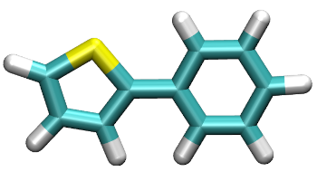

.. include:: /include/links.rst

.. _super_monomer:

=========================================================
Creating a Polymer
=========================================================

Let's try to create our first polymer by merging two similar monomers using the :mod:`pysoftk.linear\_polymer.super\_monomer` function.

First, we need to import the corresponding modules from PySoftK_ to allow us to read and join the monomers using RDKit_.

.. literalinclude:: scripts/super_monomer.py
   :lines: 1-5

Then, we can create the monomers whose SMILES codes have been inputted  using  RDKit_ :

.. literalinclude:: scripts/super_monomer.py
  :lines: 6-8

Once the monomers have been created, the PySoftK_ function can be used to join them :
	 
.. literalinclude:: scripts/super_monomer.py
  :lines: 10-11

The newly created polymer topology can be printed in XYZ format using PySoftK_ function:

.. literalinclude:: scripts/super_monomer.py
  :lines: 11-12

The final script is:

.. literalinclude:: scripts/super_monomer.py

By using common visualization software (such as VMD_), the built structure **super_monomer.py** can be displayed as shown:

The Thiol and Benzene mioeties have been joined creating a **super-monomer** that can be further used by PySoftK_ to create different configurations, 
topologies and/or investigate torsional angles in a polymer. 
