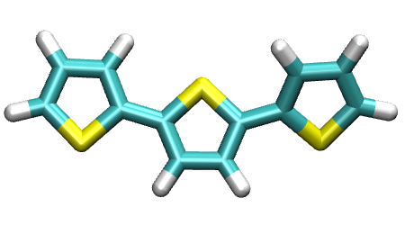

.. include:: /include/links.rst

.. _torsional:

=========================================================
Automatic torsional angle detection for planar polymers
=========================================================

PySoftK_ has a module (:mod:`pysoftk.torsional.torsional`) to automatically detect the atoms involved in torsional angles in planar polymers. Firstly, the corresponding modules from PySoftK_ and RDKit_ are imported as shown in the following snipet:

.. literalinclude:: scripts/torsional.py
   :lines: 1-4

As an example, a thiol-based linear polymer (called **molecules**) is employed to demonstrate the use of the module :mod:`pysoftk.torsional.torsional.Torsional`.

The corresponding way to invoke the function is shown in the snipet below:

.. literalinclude:: scripts/torsional.py
   :lines: 6-13

Then, PySoftK_ function *seek_angle* searches for all atoms, which are participating in the formation of relevant torsional angles. The function outputs tuples with the atomic enumeration provided by RDKit_. In the previous case, the output provided by the function is:

.. code-block:: console

   (.venv) $ [(0, 1, 5, 6), (0, 1, 5, 9), (2, 1, 5, 6), (2, 1, 5, 9),
              (6, 7, 10, 11), (6, 7, 10, 14), (8, 7, 10, 11), (8, 7, 10, 14)]

which is printing a list of tuples of all combinations of atoms found to belong to one torsional angle labeled by an atomic index. These indices can be provided to any RDKit_ function (using the same initial declared molecule) to obtain other relevant quantities of these atoms.

PySoftK_ is able to produce figures indicating the position of the involved atoms in the detected torsional angle within the molecular complex. The module :mod:`pysoftk.torsional.torsional.Torsional` accepts as an argument the RDKit_ provided molecule, whilst the function *plot_trs_ang* receives an user-provided name which will be used to name the corresponding plots. The following lines of code indicates the use of this function:

.. literalinclude:: scripts/torsional.py
   :lines: 18-22

The corresponding figures are displayed below, where the user can corrborate the atoms index with the one provided by the function PySoftK_ function *seek_angle*.
	   
.. list-table:: 
   :class: borderless

   * - .. image:: images/mol_1_mol_0.png
     - .. image:: images/mol_1_mol_1.png 

.. list-table:: 
   :class: borderless
       
   * - .. image:: images/mol_1_mol_2.png
     - .. image:: images/mol_1_mol_3.png
       
.. list-table:: 
   :class: borderless

   * - .. image:: images/mol_1_mol_4.png
     - .. image:: images/mol_1_mol_5.png 

.. list-table:: 
   :class: borderless
	   
   * - .. image:: images/mol_1_mol_6.png       
     - .. image:: images/mol_1_mol_7.png 
